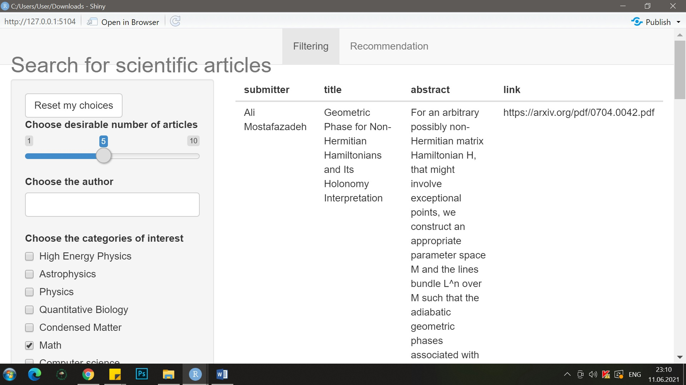
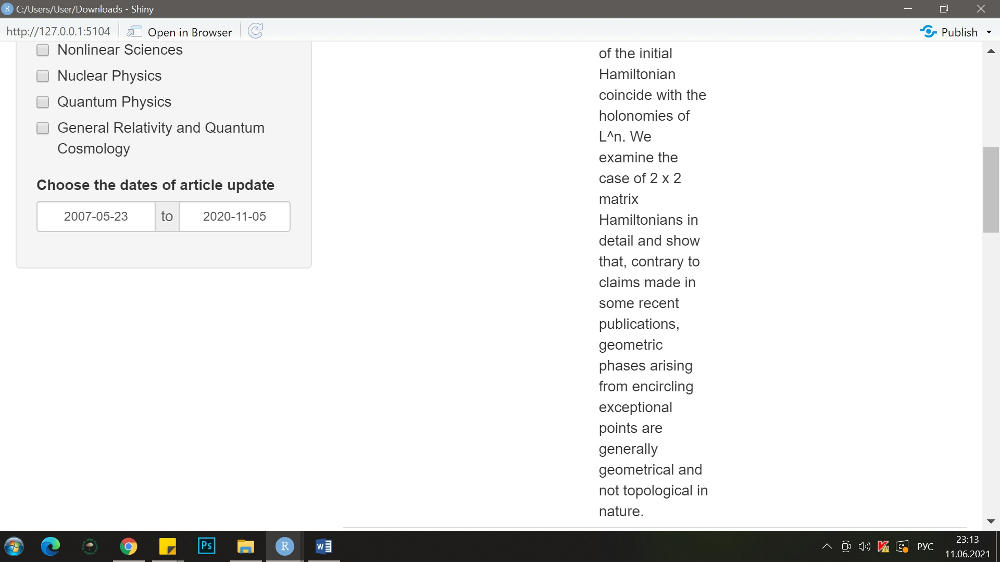
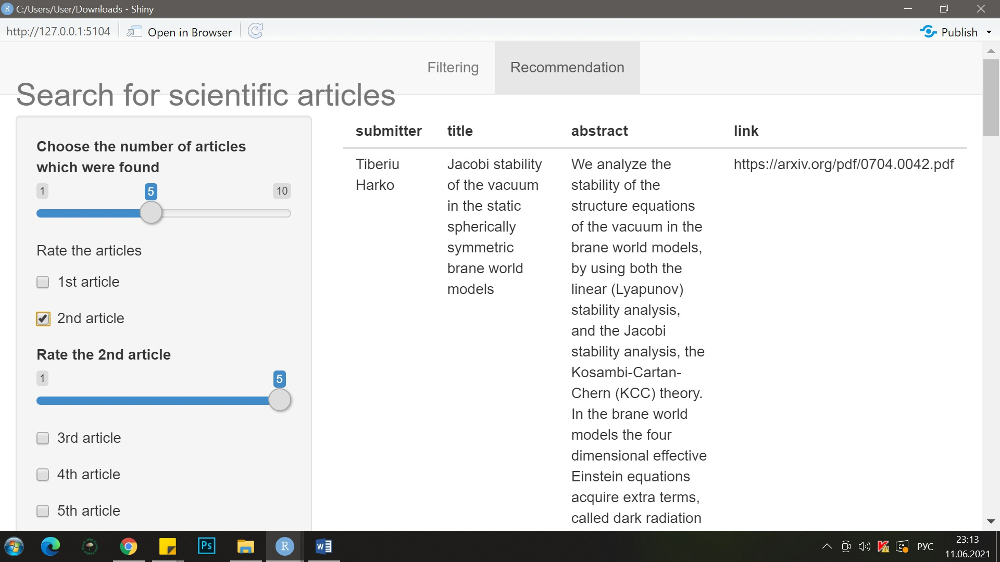

```{r setup, include = FALSE}
knitr::opts_chunk$set(warning = FALSE, message = FALSE, error = FALSE, echo = FALSE)
```

### Идея

**Тип проекта:** рекомендательный

**Данные:**

* *Идея нашей рекомендательной системы* заключается в подборе научных статей, схожих с заданной по определенным параметрам (например, по тематике, автору или периоду публикации). 
В результате мы планируем рекомендовать пользователю статьи из отфильтрованной базы данных, отобранной по критериям, которые он задал, из разных кластеров. Таким образом, наша рекомендательная система выполняет как поисковую, так и рекомендательную функции и помогает пользователям найти интересующие их статьи и подобрать схожие с ними варианты, которые также могут быть полезны посетителю.

* *Для кого этот проект:* любой пользователь, кому интересны научные статьи про STEM, целевая аудитория - студенты и преподаватели

* *Пререквизиты:* иметь электронный девайс, интересоваться научными публикациями

* *Датасет* для нашего проекта представляет собой набор данных arXiv и метаданные более 1,7 млн научных статей по STEM (science, technology, engineering and math), взят с Kaggle: https://www.kaggle.com/Cornell-University/arxiv. В датасете собрана следующая информация по статьям: имя отправителя, ее название и авторы, дополнительная информация о публикации (количество страниц) и название журнала, где размещена статья, doi (идентификатор цифрового объекта), описание (abstract), категория и история версий, дата публикации.

* *Логика проекта:* 

1. Скачали данные с Kaggle -> провели **разведочный анализ данных**
2. Оставили только 10% данных, так как изначально датасет был слишком большим и операции занимали слишком много времени.
3. Построили **сеть для выявления сообществ авторов статей**, где узел - автор, связь между ними - работа над общей статьей -> получили разбиение на слишком большое количество кластеров, решили в дальнейшем не использовать результаты сетевого анализа
4. Проанализировали описание статей с помощью **тематического моделирования методом LDA** -> в результате были выделены темы, которые совпадают с названием категорий в датасете, поэтому полученные результаты не используются в дальнейшем анализе
5. Чтобы выявить общие темы и микротемы в статьях, применили к данными **метод косинусного расстояния** -> в результате получили более существенные результаты в сравнении с тематическим моделированием, но групп выделилось слишком много
6. Применили метод машинного обучения - **k - means clustering, elbow method, silhouette method** -> в результате получили разбиение статей на 8 кластеров, в каждом кластере преобладают 1 - 2 общие тематики и схожий период публикации.
7. Проанализировали описания статей с помощью **текстового и семантического анализа** -> в результате не было выявлено каких - либо закономерностей, поскольку академический стиль письма не богат на эмоциональную окраску, результаты не использовали.
8. Перешли к **разработке серверной части приложения** ->  объединили все составляющие серверной части в одну общую функцию -> в итоге получили код, который выводит результаты фильтрации по выбранным параметрам, и выводит рекомендации, основываясь на оценке пользователем отфильтрованных результатов (применение k - means clustering).
9. Разработали **интерфейс приложения** -> создали первую вкладку, где пользователь может по заданным параметрам отфильтровать базу данных -> создали вторую вкладку, где с помощью слайдеров пользователь оценивает отфильтрованные статьи, на основе чего ему рекомендуются варианты из этого кластера с такой же темой, оставшиеся в этом отфильтрованном датасете, с другими авторами в том числе. 

* *Сценарии:* нет различий в использовании приложения новичками или опытными пользователями. Предполагаемый сценарий: вначале пользователю будет предложена возможность выбрать автора, тематику, год публикации и количество статей, желаемое получить после фильтрации, а затем ему будут предложены статьи из отфильтрованной базы данных, подходящих по характеристикам, с их описанием и ссылкой на саму статью. На второй вкладке пользователю будут предложены рекомендации, основанные на оценках отфильтрованных статей.

### Распределение ролей {.tabset .tabset-fade .tabset-pills}
 
#### Alana Zoloeva
 
Разведочный анализ, работа с тематическим моделированием, сетевой анализ, разработка серверной части приложения
 
#### Anna Sokolova
 
Работа с не ML методами (семантический анализ и текстовый анализ данных), оценка работы рекомендательной системы, подготовка финального отчета

#### Ksenia Slivkina
 
Разведочный анализ, разработка интерфейса, кластеризация, косинусное расстояние

#### Veronika Zarubina
 
Работа с кластеризацией, разработка интерфейса и серверной части приложения

### Предобработка

В процессе разведочного анализа данных были проделаны следующие этапы.

Чистка датасета: убраны лишние столбцы (report-no), перекодирована колонка с информацией на лицензию (теперь вместо ссылки на лицензию/NA, там лежит dummy (1- есть лицензия, 0- нет)). Датасет отфильтрован по наличию в комментариях слова “pages”, для дальнейшего извлечения из датасета объема articles в страницах/графиках и т.д. После очистки осталось более 132 тыс наблюдений.

Добавлена колонка с ссылкой на статью: для того, чтобы рекомендательная система выдавала пользователю не только названия и аннотации статей, но и прямые ссылки на них, мы будем использовать id статей на сайте ArXiv, с которого собраны данные. Таким образом, мы нашли способ предоставлять пользователю ссылку на PDF файл со статьей, которая будет выглядеть следующим образом:  https://arxiv.org/pdf/id.pdf . Для этого не нужна ни регистрация на сайте, ни что-либо еще, все статьи находятся в свободном доступе.

Добавлена колонка с количеством страниц в статье: из столбца comments, который содержит информацию о количестве рисунков, таблиц, страниц в статье и другие комментарии от авторов, мы вытащили данные о количестве страниц. Они помещены в отдельный столбец number_pages.

Парсинг авторов: все авторы статей перечислены неудобным образом в одной колонке authors_parsed. Мы создали колонки author1, author2, … authorN куда вписали всех авторов по отдельности. Мы оставили только те наблюдения, в которых не больше 50 авторов для удобства анализа. После этого мы удалили колонку authors_parsed. Таким образом, для каждого наблюдения имеем колонки со всеми авторами статей по отдельности. В будущем данная информация будет использована для построения коммьюнитис.

```{r, eval = FALSE, echo = TRUE}
#убираем NA колонки submitter, title, categories, abstract, update_date

filtered = dplyr::filter(Articles_10percent, Articles_10percent$update_date!= "NA")

#добавляем переменную, указывающую наличие лицензии, убираем сами ссылки на лицензии и переменную report-no

filtered$is_license = ifelse(is.na(Articles_10percent$license), 1, 0)
filtered = filtered %>% select(-license,-"report-no")

#добавляем колонку comment_pages, указывающую на наличие информации о количествах страниц

library (stringr)
filtered$comment_pages1 = str_extract_all(filtered$comment, "pages", simplify = FALSE)

#оставляем только те наблюдения, в которых есть информация об объёме статей
filtered = dplyr::filter(filtered, filtered$comment_pages1 == "pages")

#добавляем колонку с авторами

authors = try %>% select(together:author50)
dd = data.frame(c(NA),c(NA))
colnames(dd)=c('a1','a2')
i = 0
for (k in 1:nrow(authors)){
  if (length(authors[[k,1]])>1){
    i = i+1
  }}
nrow(authors)-i


authors = try %>% select(together:author50)
authors = head(authors,10000)
dd = data.frame(c(NA),c(NA))
colnames(dd)=c('a1','a2')

for (k in 1:nrow(authors)){
  if (length(authors[[k,1]])>1){
  for (i in 1:(length(authors[[k,1]])-1)){
    for (j in (i+1):length(authors[[k,1]])){
      dd = rbind(dd,c(authors[[k,1]][i],authors[[k,1]][j]))
    }}}}

authors = try %>% select(together:author50)
authors = head(authors,5000)
ddd = data.frame(c(NA),c(NA))
colnames(ddd)=c('a1','a2')

for (k in 1:nrow(authors)){
  if (length(authors[[k,1]])>1){
  for (i in 1:(length(authors[[k,1]])-1)){
    for (j in (i+1):length(authors[[k,1]])){
      ddd = rbind(ddd,c(authors[[k,1]][i],authors[[k,1]][j]))
    }}}}
```

Во время разработки приложения мы сократили данные до 15595 наблюдений, оставив 1000 авторов, потому что кнопка выбора авторов не работала из-за их большого количества.

### Методы машинного обучения

В нашем проекте мы планировали использовать k - means clustering для выделения кластеров статей по авторам, тематикам или периоду публикации, а также задействовать тематическое моделирование методом LDA. В результате применения тематического моделирования были выделены темы, которые совпадают с названием категорий в датасете, поэтому данный метод в дальнейшей работе не используется.
Мы решили остановиться на k - means clustering, elbow method, silhouette method. В итоге мы получили разбиение статей на 8 кластеров, в каждом кластере преобладают 1 - 2 общие тематики и схожий период публикации.


```{r, eval = FALSE, echo = TRUE}
#k-means работает только на непрерывных числовых данных, поэтому текстовые переменные убираем. Остаются категории,количество стараниц, даты, лицензия.

Data_K=Smaller_Data %>% select(id,update_date,is_license,number_pages,cat_hep,cat_astro,cat_math,cat_physics,cat_q_bio,cat_cond_mat,cat_cs,cat_nlin,cat_nucl,cat_quant,cat_gr_qc)

#id как имена строк.
rownames(Data_K) <- Data_K$id
Data_K=Data_K %>% select(-id)

#Из даты берем только год

Data_K$update_date=as.Date(Data_K$update_date)
Data_K$update_date=year(Data_K$update_date)

#Перемасштабируем переменные с помощью функции scale () из библиотеки dplyr.

DataS<- scale(Data_K)
df<- as.data.frame(DataS)


#Сколько кластеров выбрать?

#Elbow method (“метод согнутого колена”, он же “метод каменистой осыпи”). Построим график, где по оси абсцисс отмечено число кластеров k, а по оси ординат – значения функции W(k), которая определяет внутригрупповой разброс в зависимости от числа кластеров. Количество кластеров определяется как значение k, начиная с которого величина W(k)падает не так резко

fviz_nbclust(df, kmeans, method = "wss") +
  labs(subtitle = "Elbow method")

#По графику видно, что “колено сгибается” при k равном 5 или 8 (потому что после 5 есть все таки еще резкое падение на 7-8).

#Попробуем другой метод.
#Silhouette method (“силуэтный метод”).

fviz_nbclust(df, kmeans, method = "silhouette") +
  labs(subtitle = "Silhouette method")

#Данный метод выделает оптимальное число кластеров, равное 8.

#Попробуем реализовать кластерный анализ методом k-средних, взяв k=8

clast_k <- kmeans(df, 8)


#Посмотрим на размеры кластеров.

clast_k$size

#Запросим метки кластеров и сохраним их отдельным столбцом в датасет df

df$kmeans8 <- clast_k$cluster

# Оценка кластеризации

# Теперь посмотрим на каждый кластер в отдельности и оценим содержательно, насколько разумными они получились. 

Data$kmeans8 <- clast_k$cluster
Data %>% filter(kmeans8 == 1) %>% View()
Data %>% filter(kmeans8 == 2) %>% View()
Data %>% filter(kmeans8 == 3) %>% View()
Data %>% filter(kmeans8 == 4) %>% View()
Data %>% filter(kmeans8 == 5) %>% View()
Data %>% filter(kmeans8 == 6) %>% View()
Data %>% filter(kmeans8 == 7) %>% View()
Data %>% filter(kmeans8 == 8) %>% View()
```

В целом категории статей по кластеру довольно похожи, также часто повторяются одни и те же авторы (но это, скорее всего, связано с тем, что автор пишет статьи в одной области). Заметно, что года в основном тоже различны по кластерам (например, в 1 кластере большинство - 2007-2008 года).


### Архитектура приложения

Мы используем предобработанные отфильтрованные данные о научных статьях. Модель строится в приложении и состоит из двух главных частей: фильтрация и рекомендация. В части фильтрации датасет фильтруется по параметрам, заданным пользователем, предусматриваются все возможные ошибки (например, когда нет статей, соответствующих всем параметрам). В части рекомендации используются результаты фильтрации, а также оценка пользователем статей, предложенных ему в разделе фильтрация, для того, чтобы по тематикам и кластерам (статьи которых пользователь оценил выше всего) найти похожие статьи. Полученные данные из приложения мы никуда не сохраняем.

### Интерфейс

**Входные данные:**

*Фильтрация* - кол-во статей, которые пользователь хочет получить в фильтрации и рекомендации; авторы статей для фильтрации; 11 тематик (возможен множественный выбор); период публикации статьи. Пользователь может не выбирать автора, но должен вырать хотя бы одну тематику. По умолчанию установлен период с 2007-05-23 по 2020-11-05 и желаемое кол-во статей, равное 5. Кроме того, имеется кнопка "reset", позволяющая сбросить все параметры до параметров по умолчанию.

*Рекомендация* - кол-во статей, которые вывелись в рез-те фильтрации; checkbox с статьями, которые вывелись на предыдущем шаге: чтобы оценить их, пользователю надо нажать на галочку, тогда появится slider input, где можно поставить оценку статье. В slider input по умолчанию стоит усреднённая оценка 3, чтобы это не повлияло на рекомендации, если пользователь решит не оценивать статьи.

**Выходные данные:**

*Фильтрация*: табличка со статьями, соответсвующими критериям, назначенным пользователем, либо сообщения об ошибках: "Choose another period, please","Choose another topic or period (there is no articles on chosen topics for this period)","You should choose the topics of interest","We could find only one article (which is less than you wished), change the settings if you want more"),"We could find only", n , "articles (which is less than you wished), change the settings if you want more","Choose another author, topic or period (there is no articles of selected authors on chosen topics for this period)".

*Рекомендация*
Выводится табличка с заданным количеством рекомендованных статей либо сообщения об ошибке.
Ошибки: "Sorry, we didn't manage to find any articles, please choose other criteria for filtering", "Don't try to rate more articles than it was found, please"

**Скрин интерфейса:**



**Код интерфейса:**

```{r eval = FALSE}
# здесь код только для интерфейса
library(shiny)
library(lubridate)
library(dplyr)
library(stringr)
library(shinyjs)
artic = readRDS("artic1000.rds")
sub = sort(unique(artic$submitter))

artic = artic %>% select(kmeans8,submitter, title, abstract, link, categories,update_date,cat_hep:cat_gr_qc)
artic$kmeans8 = ifelse(artic$kmeans8 == 1,'a',ifelse(artic$kmeans8 == 2,'b',ifelse(artic$kmeans8 == 3,'c',ifelse(artic$kmeans8 == 4,'d',ifelse(artic$kmeans8 == 5,'e',ifelse(artic$kmeans8 == 6,'f',ifelse(artic$kmeans8 == 7,'g','h')))))))

artic$update_date = ymd(artic$update_date) 
artic_orig = artic

ui <- navbarPage(
  
  # Application title
  titlePanel("Search for scientific articles"),
  
  tabPanel("Filtering",
  sidebarLayout(
    sidebarPanel(
      
      useShinyjs(),
      
      actionButton("resetAll", "Reset my choices"),
      div(
      id = "form",
      sliderInput(inputId = "number", label = "Choose desirable number of articles", min = 1, max = 10, value = 5, ticks = F),
      selectizeInput(inputId = "author", label = "Choose the author", 
                  choices = sub, multiple = T), 
      checkboxGroupInput(inputId = "themes", label = "Choose the categories of interest", choices = c("High Energy Physics" =  "cat_hep",
                                                                                                "Astrophysics" = "cat_astro",
                                                                                                "Physics" = "cat_physics",
                                                                                                "Quantitative Biology" = "cat_q_bio",
                                                                                                "Condensed Matter" = "cat_cond_mat",
                                                                                                "Math" = "cat_math",
                                                                                                "Computer science" = "cat_cs",
                                                                                                "Nonlinear Sciences" = "cat_nlin",
                                                                                                "Nuclear Physics" = "cat_nucl",
                                                                                                "Quantum Physics" = "cat_quant",
                                                                                          "General Relativity and Quantum Cosmology" = "cat_gr_qc"), selected = c("cat_math" )),
      dateRangeInput(inputId = "date", label = "Choose the dates of article update", min = min(ymd(artic1000$update_date)), max = max(ymd(artic1000$update_date)), start = min(ymd(artic1000$update_date)), end = max(ymd(artic1000$update_date)))), 
    
     
      ),
    
    # Show a plot of the generated distribution
    mainPanel(
      textOutput("Found"),
      tableOutput("recArticle")
    )
  )),
  tabPanel("Recommendation",
           sidebarLayout(
             sidebarPanel(
               sliderInput(inputId = "number2", label = "Choose the number of articles which were found", min = 1, max = 10, value = 5, ticks = F),
               "Rate the articles",
               checkboxInput("r1", 
                             "1st article",
                             value = F),
               conditionalPanel(
                 condition = "input.r1",
                 sliderInput(inputId = "Rating1", label = "Rate the 1st article", min = 1, max = 5, value = 3, ticks = F),),
               
               conditionalPanel(
                 condition = "input.number2>1",
                 checkboxInput("r2", 
                               "2nd article",
                               value = F),
                 conditionalPanel(
                   condition = "input.r2",
                   sliderInput(inputId = "Rating2", label = "Rate the 2nd article", min = 1, max = 5, value = 3, ticks = F),)),
               conditionalPanel(
                 condition = "input.number2>2",
                 checkboxInput("r3", 
                               "3rd article",
                               value = F),
                 conditionalPanel(
                   condition = "input.r3",
                   sliderInput(inputId = "Rating3", label = "Rate the 3rd article", min = 1, max = 5, value = 3, ticks = F),)),
               conditionalPanel(
                 condition = "input.number2>3",
                 checkboxInput("r4", 
                               "4th article",
                               value = F),
                 conditionalPanel(
                   condition = "input.r4",
                   sliderInput(inputId = "Rating4", label = "Rate the 4th article", min = 1, max = 5, value = 3, ticks = F),)),
               conditionalPanel(
                 condition = "input.number2>4",
                 checkboxInput("r5", 
                               "5th article",
                               value = F),
                 conditionalPanel(
                   condition = "input.r5",
                   sliderInput(inputId = "Rating5", label = "Rate the 5th article", min = 1, max = 5, value = 3, ticks = F),)),
               conditionalPanel(
                 condition = "input.number2>5",
                 checkboxInput("r6", 
                               "6th article",
                               value = F),
                 conditionalPanel(
                   condition = "input.r6",
                   sliderInput(inputId = "Rating6", label = "Rate the 6th article", min = 1, max = 5, value = 3, ticks = F),)),
               conditionalPanel(
                 condition = "input.number2>6",
                 checkboxInput("r7", 
                               "7th article",
                               value = F),
                 conditionalPanel(
                   condition = "input.r7",
                   sliderInput(inputId = "Rating7", label = "Rate the 7th article", min = 1, max = 5, value = 3, ticks = F),)),
               conditionalPanel(
                 condition = "input.number2>7",
                 checkboxInput("r8", 
                               "8th article",
                               value = F),
                 conditionalPanel(
                   condition = "input.r8",
                   sliderInput(inputId = "Rating8", label = "Rate the 8th article", min = 1, max = 5, value = 3, ticks = F),)),
               conditionalPanel(
                 condition = "input.number2>8",
                 checkboxInput("r9", 
                               "9th article",
                               value = F),
                 conditionalPanel(
                   condition = "input.r9",
                   sliderInput(inputId = "Rating9", label = "Rate the 9th article", min = 1, max = 5, value = 3, ticks = F),)),
               conditionalPanel(
                 condition = "input.number2>9",
                 checkboxInput("r10", 
                               "10th article",
                               value = F),
                 conditionalPanel(
                   condition = "input.r10",
                   sliderInput(inputId = "Rating10", label = "Rate the 10th article", min = 1, max = 5, value = 3, ticks = F),))
             ),
             mainPanel(
               tableOutput("recom"),
               textOutput("Print")
             ))
))
             
  
```

### Оценивание / Выводы

Оценка рекомендательной системы проводилась двумя способами - экспертная и пользовательская.
**Экспертная оценка** была выполнена участниками группы. Поскольку мы учимся на программах экономики и менеджмента, у нас нет весомого опыта в статьях STEM, но как студенты, которые писали курсовые работы и пользовались ресурсами по поиску релевантных научных статей, можем сказать, что все участники команды остались удовлетворены качеством и результатами рекомендаций.
**Пользовательская оценка** была выполнена следующим образом. Мы создали Google форму и попросили тех, кто уже опробовал приложение, оценить приложение по нескольким параметрам - ценность приложения, удобство интерфейса, ясность и доступность, удовлетворенность рекомендациями, функциональность приложения и необходимость в улучшении приложения. Всего форму заполнило 25 человек. В таблице ниже можно видеть результаты оценивания до и после улучшения. После первого этапа оценивания (строчка 'до') мы внесли следующие изменения: добавили кнопку 'сбросить результаты', поскольку пользователи хотели после получения одной рекомендации воспользоваться приложением еще раз и добавили возможность не выбирать автора, так как не все посетители знают, каких авторов они ищут, поэтому теперь этот параметр можно выбирать опционально. После внесенных изменений средний балл по каждому критерию улучшился, что можно видеть на графике после таблицы.


### Ссылка на приложение

https://ksenia-slivkina.shinyapps.io/Project_R/
 
### Ответы на вопросы peer review

**Вопрос:**Вопрос: Не очень ясно, по какому принципу выдаются статьи при множественном выборе тем и неуказанном авторе: статьи относятся одновременно ко всем темам или к разным? Если к разным, как понять, у какой статьи какая тема?
Пример: Что будет, если я укажу 10 статей по физике и астрофизике и период с 1 июня 2015 по 1 июня 2020.
Ожидание: 10 статей по обеим тематикам различных авторов за указанный период времени.

*Ответ:*
Некоторые статьи относятся сразу к нескольким темам. При множественном выборе тем и неуказанном авторе выбираются все статьи этих тем, но это не значит, что одна статья должна относиться ко всем сразу. Понять тему статьи можно почитав abstract.
Пример был введён в рекомендательную систему и ожидания были удовлетворены.

**Вопрос:** Пример: Количество статей: 5
Авторы: Yang Sun, A.C. Fabian
Области: Math, Computer science, Nonlinear Sciences, Nuclear Physics
Ожидание: Yang Sun - The Origin of Fermi Arcs in Cuprate Pseudogap States and Strong Constraints on Viable Theories of High-Temperature Superconductivity

*Ответ:*
Мы ввели эти данные в рекомендательную систему, и статья не была выведена.


*Вопрос:*
В целом приложение представляет из себя скорее инструмент для фильтрации выдачи данных нежели полновесную рекомендательную систему. В приложение нет элемента рекомендации - то есть оно просто откликается на прямой запрос пользователя, не предлагая ничего пользователю, помимо того, что можно найти не прибегая к помощи отдельного приложения. Простой поисковой запрос в поисковую систему или внутренний поиск в данных с примененной фильтрацией давал бы похожие результаты. Более того, в выводе рекомендации недостаточно данных. Не хватает названия исследовательского поля, года выпуска - особенно в случаях, когда одновременно выбраны либо несколько тем либо большой промежуток времени. Ссылку можно было интегрировать в название для создания гиперссылки и освобождения места для более полезной информации. И наконец, не совсем понятно по каким принципам выдаются рекомендованные статьи особенно в случаях, когда требования к фильтрации данных указаны очень широко и включают в себя множество тем , авторов и годов одновременно.

*Ответ:* 
К итоговому отчету мы немного изменили концепцию рекомендательной системы. Теперь рекомендованные статьи выдаются по следующему принципу: вначале происходит фильтрация данных на основе запросов пользователя и выдает заданное пользователем число статей; затем система предлагает пользователю оценить эти статьи, то, насколько они соответствуют его ожиданиям и интересам по шкале от 1 до 5; в итоге система выдает окончательную рекомендацию на основе того, статьи из каких кластеров и по каким темам более всего понравились пользователю. Наличие оценки пользователем качества, соответствия его запросу статей и последующий отбор статей из наиболее высоко оцененного набора кластер+тема, отличает нашу систему от простого инструмента фильтрации. Её преимущество заключается в том, что использование отклика пользователя позволяет нам скорректировать рекомендации под его предпочтения. Если же «требования к фильтрации данных указаны очень широко и включают в себя множество тем, авторов и годов одновременно», то после фильтрации система действительно выдаст довольно разнородные статьи в качестве рекомендации. Однако, последующая оценка пользователем каждой статьи позволяет лучше понять интересы и пожелания пользователя и в дальнейшем скорректировать список рекомендованных статей. 
      
*Пример:* Хочу получить похожее исследование.Title of the Article: New applications of renormalization group methods in nuclear physics. Authors: R J Furnstahl and K Hebeler
*Ожидание:* 
В статье описываются новые применения методов групп ренормализации в низкоэнергетической ядерной физики и мне хотелось бы получить набор исследований на эту тему произведенных до упомянутого исследования.

*Ответ:* Наша рекомендательная система не рассчитана на то, чтобы рекомендовать похожие статьи на конкретно заданную статью. Однако, если, судя из названия статьи, человека интересует тема nuclear physics, то наша система тоже подобрать статьи из этой категории. 

*Пример:*
5 статей, Computer science, 2019-2020 год

*Ответ:* Пользователю будут выданы следующие рекомендации, если он оценит все выданные после фильтрации статьи одинаково: “Development of Tracking Detectors with industrially produced GEM Foils”, “A Monolithic Pixel Sensor in 0.15 micron Fully Depleted SOI Technology”, “Particle Tracking with a Thin Pixel Telescope”, “The STAR Tracking Upgrade”, “Radiation Hardness Studies in a CCD with High-Speed Column Parallel Readout”.

*Вопрос:*
Я задумалась о том, стоит ли рекомендовать пользователям статьи таким образом, чтобы они принадлежали максимально большему количеству разных кластеров. С одной стороны, у авторов проекта понятная мотивация: сделать так, чтобы у пользователей был выбор и они видели "наиболее полную картину". С другой стороны, как мне кажется, часто приходится искать статьи по достаточно узкой тематике, и в таком случае более строгая фильтрация была бы уместна и полезна (особенно, когда какая-то тема еще не изучена, порой приходится самостоятельно отсеивать не совсем подходящие статьи и выискивать небольшое число подходящих).

*Ответ:*
Автор вопроса, возможно, не понял логику использования ML. Мы не предлагаем статьи, которые не подходят по фильтрации. Однако очень часто бывает, что даже после фильтрации, остается большое количество статей (например, 100) из которых мы выводим максимум 10. Чтобы выбрать из ста 10, нужна была какая-то логика, и раз все статьи подходят пользователю по установленным ему критериям – мы пользовались логикой – предоставить наиболее различные статьи. Далее, на наш взгляд, пользователь изучал статьи и пользовался бы системой повторно, выбирая более жёсткие рамки для фильтрации, например, только тех авторов, которые ему пришлись по душе. На данный момент мы изменили концепцию, добавив раздел с рекомендациями, которые автоматически подбираются после оценки пользователем статей.

*Пример:*
Мне проще придумать пример про статьи в области социальных наук (прошу прощения за узость интересов, возможно, он всё-таки чем-то будет полезен). Допустим, я хочу найти статьи по философии и социальной антропологии, автор "А. Арамян".
*Ожидание:* Я ожидаю получить, например, такие статьи: "От Анти-Эдипа к Анти-Хайпу:
критика гиперверия", "Фетиш индейцев и фетиш испанцев: Понятие фетишизма и антропология "онтологического поворота"", "Technologies without future: On possibility of the decolonization of discourse".

*Ответ:*
В датасете используются статьи исключительно технического характера, например не релевантен

*Вопрос:*
Очень похоже на WoS viewer по функционалу, возможно, хотелось бы чего-то, что та программа не умеет; Можно ли ограничивать поиск по дате издания статьи? Что если таких статей больше 10?

*Ответ:*
Можно ограничить поиск по дате издания статьи, в нашем приложении предусмотрен отдельный параметр для этого на первой вкладке на этапе фильтрации базы данных. В случае если таких статей больше 10, можно нажать кнопку сбросить выбор, указать эти же параметры еще раз и система выдаст другие статьи.

*Пример:* 
Что я получу, если я захочу найти 10 статей по квантовой физике?
*Ожидание:*
На самом деле, сложно предположить, так как я не уверена, есть ли среди данных другие авторы

*Ответ:*
При выборе темы квантовая физика и количества статей 10, возможны следующие результаты: 1) Theezed thermal states: statistical properties and its decoherence in a photon-loss channel, Liyun Hu; 2) Dimer-atom scattering between two identical fermions and a third particle, Menderes Iskin; 3) the quantum correlations in light-harvesting complexes, Mark Wilde; 4) Regulating atomic imbalance in double-well lattices, Vyacheslav Yukalov; 5) Exactly solvable effective mass D-dimensional Schrodinger equation for pseudoharmonic and modified Kratzer problems, Ramazan Sever; 6) Quantum interference structures in trapped ion dynamics beyond the Lamb-Dicke and rotating wave approximations, Jonas Larson; 7) Memory effects in a Markov chain dephasing channel, Giuliano Benenti. generalized Abel-Plana formula with applications to Bessel functions and Casimir effect, Saharian; 8) Weak Cosmic Censorship: As Strong as Ever, Shahar Hod; 9) Analysis of Optical Deshelving in Photon Echo-based Quantum Memories, Byoung Ham; 10) Photon--added sque


*Вопрос:* 
Интересно, есть ли у создательниц опыт в STEM, и кто участвовал в оценке интерфейса, были ли это студенты технических ОП?

*Ответ:*
Поскольку мы учимся на программах экономики и менеджмента (не технические образовательные программы), у нас нет весомого опыта в статьях STEM, но как студенты, которые писали курсовые работы и пользовались ресурсами по поиску релевантных научных статей, можем сказать, что все участники команды остались удовлетворены качеством и результатами рекомендаций.

*Пример:* 
Количество статей: 10
Автор не указан
Категория: астрофизика
Даты: 2010-2020
*Ожидание:*
Я посмотрела самые цитируемые статьи за последние 90 дней (предполагаю, что если они цитируемы, то должны быть важны) в журнале https://www.aanda.org, из тех, что подходят по датам, одна статья:
The FORS1 catalogue of stellar magnetic field measurements
S. Bagnulo, L. Fossati, J. D. Landstreet and C. Izzo
Published online: 04 November 2015

*Ответ:*
 В примере получили следующие результаты: 1) Gravitational waves and pulsar timing: stochastic background, individual sources and parameter estimation, Alberto Sesana; 2) Explicit constructions of infinite families of MSTD sets, Steven Miller; The classification of large spaces of matrices with bounded rank, Cl\'ement de Seguins Pazzis; 3) Phenomenological Aspects of Horava-Lifshitz Cosmology, Kazunori Nakayama; 4) Pappus-Desargues digraph confrontation, Italo Dejter Prof; 5) Powers in a class of A-strict standard episturmian words, Amy Glen; 6) Relativistic Variable Eddington Factor, Jun Fukue; 7) Energy of tsunami waves generated by bottom motion, Denys Dutykh; 8) Calculation of the Characteristic Functions of Anharmonic Oscillators, Ulrich Jentschura; 9) Loop Vertex Expansion for Phi^2k Theory in Zero Dimension, Vincent Rivasseau.


*Вопрос:* Хотела бы уточнить, зачем при выводе статей, она должна принадлежать "максимально большему количеству разных кластеров"? не суть ли в том, чтобы наоборот найти именно одну-две статьи принадлежащие узкой теме, по которой пользователь пишет работу, например? Девочки дали ответ, что это нужно для того чтобы пользователю была доступна "наиболее широкая, разносторонняя и полная картина", но по-возможности, я бы хотела уточнить что под этим имеется в виду. Еще один вопрос, что будет если указать автора и область, в которой у него нет исследований?

*Ответ: * Если указать автора и область, в которой у него нет исследований, об этом сообщит система и попросит ввести менее строгую фильтрацию, например, добавить тем.Что каасается первой части вопроса - ответ уже был дан: Мы не предлагаем статьи, которые не подходят по фильтрации. Однако очень часто бывает, что даже после фильтрации, остается большое количество статей (например, 100) из которых мы выводим максимум 10. Чтобы выбрать из ста 10, нужна была какая-то логика, и раз все статьи подходят пользователю по установленным ему критериям – мы пользовались логикой – предоставить наиболее различные статьи. Далее, на наш взгляд, пользователь изучал статьи и пользовался бы системой повторно, выбирая более жёсткие рамки для фильтрации, например, только тех авторов, которые ему пришлись по душе. На данный момент мы изменили концепцию, добавив раздел с рекомендациями, которые автоматически подбираются после оценки пользователем статей.

*Пример: *Я бы хотела найти статьи автора A.H. Rezaelan, ввести область Math, время публикаций все время и количество книг 6.
*Ожидание: *Так как я не уверена, что этот автор занимался математикой, могу предположить, что система может не вывести статьи, вывести статьи этого автора или вывести статьи по математике других авторов, также может быть выведена запись о том, что такое количество статей не было найдено, и тогда я увижу менее 6 статей (вопрос, какой вариант правильный был задан несколькими полями выше). Если я уберу область (математику), то скорее всего я получу 6 или менее статей введенного мною автора, с указанием автора, названием статьи, кратким содержанием и ссылкой.

*Ответ:* У данного автора нет статей по математике, выведется сообщение: Choose another author, topic or period (there is no articles of selected authors on chosen topics for this period)

*Вопрос:* Вы вроде не упоминали, что в датасете есть ссылки к каждой статье. Если их не было в изначальном датасете на Kaggle, то интересно, как вы их получили. 

*Ответ:* На сайте ArXiv была инструкция к тому, как получить доступ к статьям в формате PDF: вставить в ссылку (https://arxiv.org/pdf/id.pdf)  id статьи, которые уже были в нашем датасете. Поэтому была создана колонку вот с такой ссылкой и уже конкретным id каждой статьи. Если вставить в поисковик, сразу открывается статья, они все в свободном доступе.

*Пример:*
Что будет, если я скажу, что хотела бы получить рекомендацию по следующим параметрам: 10 статей, любой автор, категория "physics" в период с 1 января 2019 года по 1 января 2020 года?
*Ожидание: *
https://www.nature.com/articles/s41567-019-0743-x 

*Ответ:* К сожалению, когда фильтрация не жёсткая (то есть, например, нет указания авторов), то выбор системы имеет долю случайности, просто выводятся статьи, фильтруемые по необходимым параметрам

*Вопрос:* Не совсем понятно, в чем заключается именно рекомендательность системы: я поняла, что вы начали делать кластеризацию статей разными способами и в итоге выделили 8 кластеров, но какой именно показатель схожести в итоге используется для рекомендации? Из презентации и тестирования приложения у меня создалось впечатление, что оно работает по принципу поисковой системы: пользователь вводит запрос, и ему выдаются статьи, соответствующие введенным критериям.
Это особенно заметно в случае, если пользователь выбирает показать например 10 статей, но из-за жесткой фильтрации система выдает только 1-2 статьи, строго соответствующие параметрам.
По какому принципу показываются статьи? Если я например выбираю показать мне работы по биологии за весь период, почему именно конкретные 5 работ показываются сверху?

*Ответ:*
Для кластеризации методом k-средних были использованы следующие переменные: категории статей (дамми-переменные для каждой категории), количество страниц, дата выхода и наличие/отсутствие лицензии. На основе схожести статей по этим параметрам и производилась кластеризация. Принцип работы системы и отличие её от просто «поисковой системы» таковы: пользователь вводит запрос, и ему выдаются статьи, соответствующие введенным критериям» заключается в следующем. Рекомендательная система фильтрует данные по заданным пользователем параметрам. Первыми в списке оказываются по умолчанию рандомные 5 статей, соответствующие заданным характеристика, или любое другое указанное пользователем количество статей. После этого система предлагает пользователю оценить эти статьи шкале от 1 до 5: насколько ему понравились рекомендации; в итоге система выдает окончательную рекомендацию на основе того, статьи из каких кластеров и по каким темам более всего понравились пользователю. Первыми в списке снова оказываются по умолчанию рандомные 5 статей или любое другое указанное пользователем их количество, которые относятся к наиболее понравившемуся пользователю набору кластер+тема. 

*Пример:* 5 работ по астрофизике всех авторов за последние полгода
*Ожидание:* Сложно что-то ожидать, так как я не знакома ни с одной из научных областей, по которым написаны работы.

*Ответ:* 
если считать, что “за последние года” - это статьи с 2018 года и если пользователь оценит все выданные после фильтрации статьи одинаково, то в итоговой рекомендации приложение выдаст следующие 5 статей: “Comments on ``Are Swift Gamma-Ray Bursts consistent with the Ghirlanda relation?", “VLBI observations of nineteen GHz-Peaked-Spectrum radio sources at 1.6 GHz”, “Dust and gas emission in the prototypical hot core G29.96-0.02 at sub-arcsecond resolution”, “The Formation of Globular Cluster Systems in Massive Elliptical Galaxies: Globular Cluster Multimodality from Radial Variation of Stellar Populations”, “Proto-Neutron Star Winds, Magnetar Birth, and Gamma-Ray Bursts”.


### Чем вы гордитесь в своем приложении

Мы гордимся тем, что нам удалось проработать возможные ошибки системы и вывести для каждого из случая конкретное решение для пользователя
 
Кроме того, наш интерфейс выглядит аккуратно и не загружено, приятно осознавать, что пользователи высоко оценили нашу рекомендательную систему


